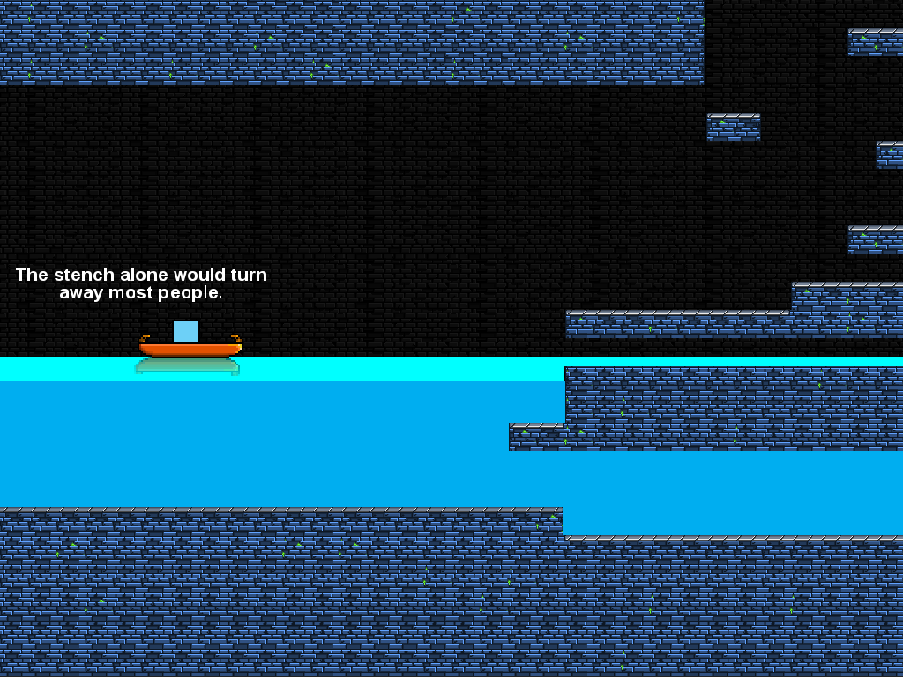
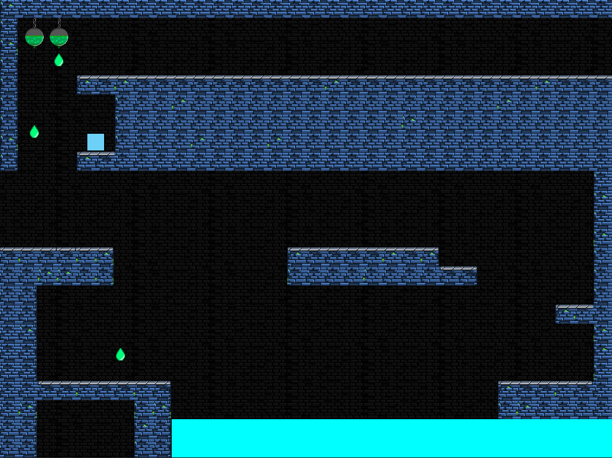
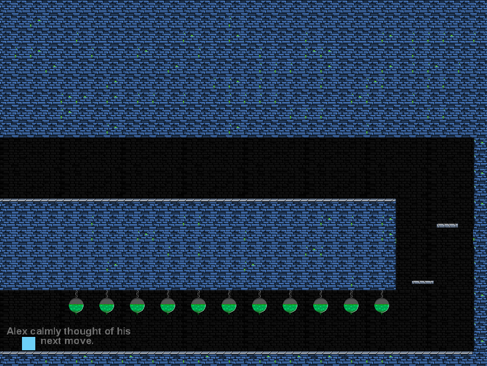

 Livin la vida cuadrado 
Download installer

# The Project


Alex is a 2D platformer I made in a couple days back in 2016 to try out [GMS2](https://gamemaker.io/en).

It's a short 1-2 minute long game about a square who fights and solves platforming puzzles using kind words. 

## Tools used  
**Game Engine**: Game Maker Studio 2
**2D art**: Aseprite 
**Language**: GameMaker Language

## My part  
This was a very quick project made with the sole purpose of trying out a new engine. 
Tasks related to the project include:
- Pixel art
- Character movement
- Level design and platforming puzzles
- Combat and character propelling mechanic
- Obstacles 
- Enemy AI

## Screenshots

    
    
    
    
